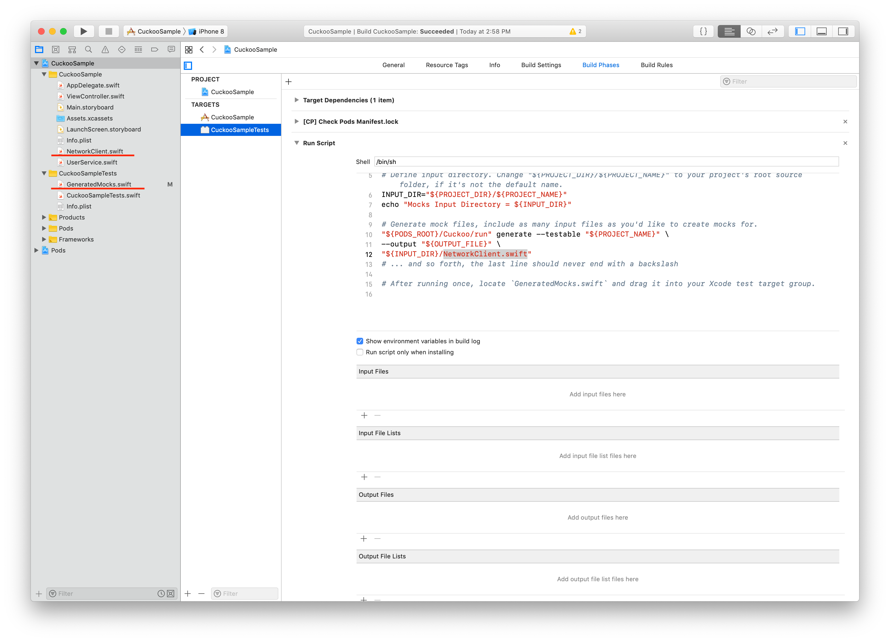

# SwiftCuckooUnitTestSample

A sample project for writing Swift unit test with Cuckoo & CocoaPods

## 1 Init

Use "pod install" to install library

## 2 Run

Open generated workspace and run the test.

## Note

Do not forget to add the target class into the build script before you trying to mock another class.

